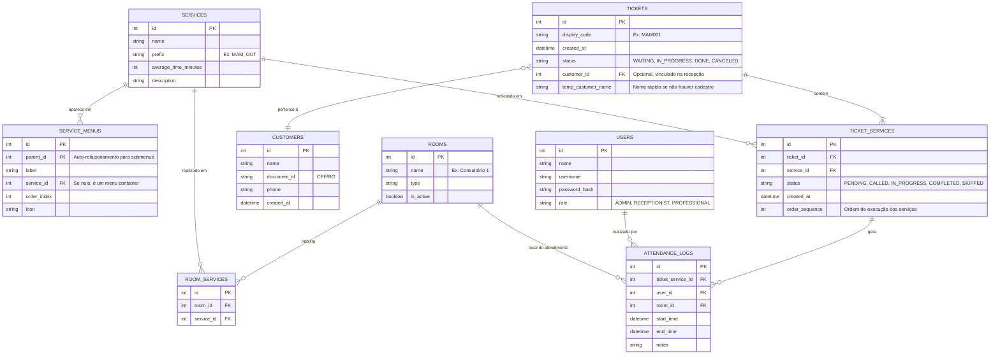

# Star Tickets - Sistema de Gestão de Senhas e Atendimento

## 📋 Sobre o Projeto

O **Star Tickets** é um sistema completo e inteligente para gestão de filas, senhas e fluxo de atendimento em estabelecimentos comerciais e de saúde. O sistema visa otimizar a jornada do cliente desde a chegada até a finalização do serviço, garantindo organização, previsibilidade e eficiência.

O diferencial do Star Tickets reside na sua capacidade de gerenciar múltiplos serviços, agendamentos e fluxos complexos (pacientes passando por múltiplas salas) de forma transparente e automatizada.

## 🏗️ Modelo do Sistema

A arquitetura foi desenhada para ser leve, fácil de implantar e manter, utilizando tecnologias modernas e robustas.

*   **Backend:** Node.js (API REST/GraphQL)
*   **Banco de Dados:** SQLite (Armazenamento local eficiente e portátil)
*   **Frontend:** Web (Single Page Application - SPA) acessível via navegador em diferentes dispositivos (Totems, Desktops, Smart TVs).
*   **Comunicação:** WebSockets para atualização em tempo real (chamadas na TV, atualização de filas).

## 🔄 Fluxos de Usuário

A jornada do cliente no sistema segue um fluxo estruturado e monitorado em cada etapa:

1.  **Chegada (Autoatendimento):** O cliente interage com o Totem, seleciona os serviços desejados através de menus dinâmicos e retira sua senha impressa.
2.  **Triagem/Recepção:** O cliente aguarda ser chamado ou se dirige à recepção. A recepcionista vincula a senha anônima ao cadastro do cliente (Nome).
3.  **Espera Inteligente:** O cliente aguarda na sala de espera. O sistema calcula a ordem de chamada baseada em prioridades, agendamentos e ordem de chegada.
4.  **Chamada (TV):** O nome do cliente e a senha são exibidos na TV com alerta sonoro, indicando a sala de destino.
5.  **Atendimento:** O profissional realiza o atendimento. Se houver múltiplos serviços, ao finalizar o primeiro, o sistema automaticamente coloca o cliente na fila do próximo serviço/sala.
6.  **Finalização:** O ciclo se encerra quando todos os serviços solicitados forem concluídos.

## 🖥️ Interfaces e Telas

O sistema é composto por quatro interfaces principais, cada uma adaptada ao seu contexto de uso:

### 1. 🎫 Totem de Autoatendimento
*Focado na agilidade e facilidade de uso para o cliente final.*

*   **Tela Inicial:** Botões grandes e claros para "Retirar Senha" ou "Tenho Agendamento".
*   **Menus de Serviço:** Navegação intuitiva por categorias (ex: Exames, Consultas) configuráveis via banco de dados.
*   **Seleção Múltipla:** Permite selecionar vários serviços de uma vez (ex: Exame de Sangue + Raio-X).
*   **Feedback:** Exibe estimativa de tempo de espera baseada na fila atual e histórico de atendimentos.
*   **Impressão:** Confirmação visual e emissão do ticket físico com senha (ex: MAM001) e QR Code para acompanhamento pelo celular (futuro).

### 2. 👥 Estação da Recepção
*Ferramenta de controle e organização para a equipe de frente.*

*   **Dashboard de Senhas:** Lista em tempo real das senhas emitidas pelo totem que ainda não foram vinculadas.
*   **Vinculação Rápida:** Campo de busca para localizar cadastro do paciente e associar à senha com um clique.
*   **Gerenciamento de Fila:** Permite alterar a prioridade, corrigir serviços selecionados erroneamente (sem precisar trocar a senha impressa) e direcionar para filas específicas.
*   **Status da Sala de Espera:** Visão geral de quantas pessoas estão aguardando e tempo médio de espera.

### 3. 📺 Painel de Chamada (TV)
*Interface visual para orientação e organização do público.*

*   **Destaque Principal:** Quando chamado, o **Nome do Paciente** aparece em tamanho grande e destaque, com a senha logo abaixo (foco na humanização).
*   **Indicação de Sala:** Mostra claramente para onde o cliente deve se dirigir (ex: "Consultório 3", "Sala de Coleta 1").
*   **Histórico:** Lista lateral com as últimas 3-5 chamadas para quem perdeu o alerta sonoro.
*   **Mídia/Entretenimento:** Área dedicada para conteúdos institucionais, notícias ou entretenimento enquanto não há chamadas prioritárias.

### 4. 🏥 Estação do Profissional (Sala de Atendimento)
*Interface minimalista para não distrair o profissional do atendimento.*

*   **Seleção de Sala:** Login simples selecionando em qual sala/posto o profissional está atuando.
*   **Botão de Ação:** Botão grande "Chamar Próximo" que aciona a TV e o sistema de som.
*   **Informações do Paciente:** Ao chamar, exibe nome, serviços a serem realizados e observações da recepção.
*   **Controle de Fluxo:** Botões para "Iniciar Atendimento", "Finalizar" (libera para próxima etapa ou encerra) e "Ausente" (se o paciente não aparecer).
*   **Fila da Sala:** Visualização discreta de quantos pacientes aguardam especificamente para aquela sala/serviço.

## 🧠 Inteligência do Sistema

*   **Gestão de Múltiplos Serviços:** O sistema impede que um paciente seja chamado em duas salas ao mesmo tempo. Ele só entra na fila da "Sala 2" após o profissional da "Sala 1" finalizar o atendimento.
*   **Priorização de Agendamentos:** O sistema cruza a hora de chegada com o horário agendado, garantindo que atrasos na chegada não prejudiquem a agenda, mas respeitando quem chegou no horário.
*   **Estimativas Reais:** O cálculo de tempo de espera aprende com o histórico, tornando-se mais preciso com o uso.

## 🛠️ Instalação e Configuração

*(Seção a ser detalhada conforme o desenvolvimento avança)*

1.  Clone o repositório.
2.  Instale as dependências: `npm install`
3.  Configure o banco de dados SQLite.
4.  Inicie o servidor: `npm start`

# Diagramas do Banco de Dados - Star Tickets

Este documento detalha a estrutura do banco de dados SQLite planejado para o sistema Star Tickets.

## 📐 Diagrama Entidade-Relacionamento (ERD)

## 📝 Descrição das Tabelas

### 1. Configuração e Catálogo

*   **SERVICES**: Define os serviços oferecidos (ex: Exame de Sangue, Raio-X, Consulta). O `prefix` é usado para gerar a senha.
*   **SERVICE_MENUS**: Estrutura hierárquica para o Totem. Permite criar menus aninhados (Ex: Exames -> Imagem -> Raio-X). Se `service_id` for preenchido, é um botão final que seleciona o serviço.
*   **ROOMS**: Salas físicas ou postos de atendimento.
*   **ROOM_SERVICES**: Tabela de ligação que define quais serviços podem ser realizados em quais salas (Muitos-para-Muitos).

### 2. Fluxo de Atendimento

*   **TICKETS**: Representa a "sessão" do cliente. Contém o código da senha (ex: MAM001) e o status geral.
*   **TICKET_SERVICES**: Os itens solicitados no ticket. Um ticket pode ter múltiplos serviços. Esta tabela controla o fluxo passo-a-passo. O campo `status` aqui indica se aquele serviço específico já foi feito.
*   **CUSTOMERS**: Cadastro de clientes. Pode ser preenchido na recepção para vincular ao Ticket.

### 3. Operação e Histórico

*   **USERS**: Usuários do sistema (Recepcionistas, Médicos, Admins).
*   **ATTENDANCE_LOGS**: Registro histórico de cada atendimento realizado. Crucial para relatórios de performance e tempos de espera. Registra quem atendeu, onde, quando começou e quando terminou.

## 🔄 Lógica de Múltiplos Serviços

A tabela `TICKET_SERVICES` é o coração da lógica de múltiplos atendimentos.
1.  Quando um ticket é criado, os serviços são inseridos nesta tabela com status `PENDING`.
2.  O sistema busca o próximo serviço `PENDING` com menor `order_sequence`.
3.  Este serviço entra na fila virtual das salas que atendem aquele `service_id`.
4.  Quando finalizado (`COMPLETED`), o sistema verifica se há outro serviço `PENDING` para o mesmo ticket e repete o processo.

