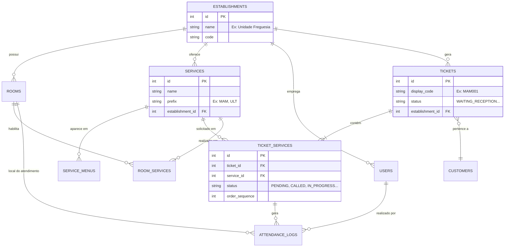

# Star Tickets - Sistema de Gestão de Senhas e Atendimento

## 📋 Sobre o Projeto

O **Star Tickets** é um sistema completo e inteligente para gestão de filas, senhas e fluxo de atendimento em estabelecimentos comerciais e de saúde. O sistema visa otimizar a jornada do cliente desde a chegada até a finalização do serviço, garantindo organização, previsibilidade e eficiência.

O diferencial do Star Tickets reside na sua capacidade de **Gestão Multi-Unidade (Estabelecimentos)**, permitindo que uma única instalação gerencie múltiplas filiais (Freguesia, Santana, Guarulhos, etc.), cada uma com seus próprios serviços, salas e filas.

## 🏗️ Arquitetura Técnica

A arquitetura foi desenhada para ser leve, fácil de implantar e manter, utilizando tecnologias modernas e robustas.

*   **Backend:** Node.js com Express Framework.
*   **Banco de Dados:** SQLite (`star-tickets.db`) - Armazenamento local eficiente, sem necessidade de servidor de banco de dados externo complexo.
*   **Real-time:** Socket.IO - Utilizado para comunicação instantânea entre o servidor e os clientes (atualização de filas na recepção, chamadas na TV, status de mesas).
*   **Frontend:** HTML5, CSS3 e JavaScript (Vanilla + jQuery-like interactions). O frontend é servido estaticamente pelo Express (`public/`).
*   **Design:** Interface responsiva e moderna, adaptada para Totems (Touch), Desktops e TVs.

## 📂 Estrutura do Projeto

```
star-tickets/
├── server/                 # Código do Servidor (Backend)
│   ├── index.js            # Ponto de entrada (Express + Socket.IO)
│   ├── routes/             # Rotas da API (Auth, Tickets, Dashboard, etc.)
│   ├── middleware/         # Middlewares (Autenticação, Logs)
│   └── utils/              # Funcionalidades utilitárias (Logger)
├── public/                 # Arquivos Estáticos (Frontend)
│   ├── *.html              # Páginas principais (totem, reception, tv, etc.)
│   ├── js/                 # Lógica do cliente
│   ├── css/                # Estilização
│   └── img/                # Assets
├── database/               # Camada de Dados
│   ├── init.js             # Script de inicialização e schema do banco
│   ├── seed.js             # Dados de teste
│   └── star-tickets.db     # Arquivo do banco de dados (gerado)
└── package.json            # Dependências e Scripts
```

## 🚀 Instalação e Execução

### Pré-requisitos
*   Node.js instalado (v14+ recomendado).

### Passos

1.  **Instalar Dependências:**
    ```bash
    npm install
    ```

2.  **Configurar Banco de Dados:**
    Se for a primeira execução ou para resetar o banco:
    ```bash
    npm run db:reset
    ```
    *Isso criará o arquivo `database/star-tickets.db` com as tabelas e dados iniciais (estabelecimentos, serviços, usuários).*

3.  **Rodar o Servidor:**
    *   Modo de Produção:
        ```bash
        npm start
        ```
    *   Modo de Desenvolvimento (com auto-reload):
        ```bash
        npm run dev
        ```

4.  **Acessar:**
    O servidor iniciará na porta `3000` (padrão).
    *   **Totem:** `http://localhost:3000/totem.html`
    *   **Recepção:** `http://localhost:3000/login.html` (Use `recepcao1` / `123`)
    *   **Profissional:** `http://localhost:3000/login.html` (Use `profissional1` / `123`)
    *   **TV:** `http://localhost:3000/login.html` (Use `tv1` / `123`)
    *   **Gerente:** `http://localhost:3000/login.html` (Use `gerente1` / `123`)

## 🔄 Fluxos de Usuário

1.  **Chegada (Autoatendimento - Totem):** O cliente seleciona serviços (Ex: "Ultrassom") e retira uma senha (ex: `ULT001`). O sistema cria um Ticket com status `WAITING_RECEPTION`.
2.  **Triagem (Recepção):** A recepcionista visualiza a senha, chama o cliente ao balcão e vincula seus dados (Nome). O status muda para `IN_RECEPTION` e depois `WAITING_SERVICE`.
3.  **Atendimento (Profissional):** O médico seleciona sua sala (ex: "Sala 1"). O sistema mostra apenas as senhas aptas para os serviços que aquela sala realiza. Ao chamar, status vira `CALLED` (aciona TV).
4.  **TV (Painel):** Exibe a senha chamada e a sala, com alerta sonoro.
5.  **Conclusão:** O profissional inicia (`IN_PROGRESS`) e finaliza (`FINISHED`) o atendimento. Se houver mais serviços no ticket, o paciente volta para a fila do próximo setor.

## 💾 Modelo de Dados (ERD)

O sistema é multi-tenant por design, onde **Establishments** (Unidades) agrupam usuários, salas e serviços.



## 🗺️ Roadmap e Funcionalidades Planejadas

Baseado nas diretrizes de desenvolvimento (`reuniao.txt`):

*   [ ] **Filtro de Convênios:** Adicionar filtro de busca por convênios na lista de senhas.
*   [ ] **Correção de Senha:** Fluxo para corrigir senhas emitidas erradas sem perder o lugar na fila.
*   [ ] **Termos de Consentimento:** Sistema para preenchimento de termos obrigatórios por serviço (via Tablet/Totem), integrando com status na recepção.
*   [ ] **Encaminhamento Inteligente:** Lógica automática para redirecionar pacientes entre salas dependendo da carga de trabalho (balanceamento).
*   [ ] **Web Check-in:** QR Code para o cliente preencher dados (carteirinha, telefone) antecipadamente.
*   [ ] **Painel do Gerente Avançado:**
    *   Controle de prioridade de salas.
    *   Remanejamento de filas ("Drag & Drop" ou IA sugerida).
    *   Relatórios de produtividade por recepcionista/médico.
*   [ ] **Segurança:** Refinar permissões de acesso e proteção de rotas no backend.
