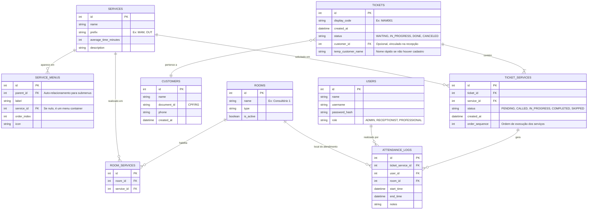

# Diagramas do Banco de Dados - Star Tickets

Este documento detalha a estrutura do banco de dados SQLite planejado para o sistema Star Tickets.

## 📐 Diagrama Entidade-Relacionamento (ERD)

## 📝 Descrição das Tabelas

### 1. Configuração e Catálogo

*   **SERVICES**: Define os serviços oferecidos (ex: Exame de Sangue, Raio-X, Consulta). O `prefix` é usado para gerar a senha.
*   **SERVICE_MENUS**: Estrutura hierárquica para o Totem. Permite criar menus aninhados (Ex: Exames -> Imagem -> Raio-X). Se `service_id` for preenchido, é um botão final que seleciona o serviço.
*   **ROOMS**: Salas físicas ou postos de atendimento.
*   **ROOM_SERVICES**: Tabela de ligação que define quais serviços podem ser realizados em quais salas (Muitos-para-Muitos).

### 2. Fluxo de Atendimento

*   **TICKETS**: Representa a "sessão" do cliente. Contém o código da senha (ex: MAM001) e o status geral.
*   **TICKET_SERVICES**: Os itens solicitados no ticket. Um ticket pode ter múltiplos serviços. Esta tabela controla o fluxo passo-a-passo. O campo `status` aqui indica se aquele serviço específico já foi feito.
*   **CUSTOMERS**: Cadastro de clientes. Pode ser preenchido na recepção para vincular ao Ticket.

### 3. Operação e Histórico

*   **USERS**: Usuários do sistema (Recepcionistas, Médicos, Admins).
*   **ATTENDANCE_LOGS**: Registro histórico de cada atendimento realizado. Crucial para relatórios de performance e tempos de espera. Registra quem atendeu, onde, quando começou e quando terminou.

## 🔄 Lógica de Múltiplos Serviços

A tabela `TICKET_SERVICES` é o coração da lógica de múltiplos atendimentos.
1.  Quando um ticket é criado, os serviços são inseridos nesta tabela com status `PENDING`.
2.  O sistema busca o próximo serviço `PENDING` com menor `order_sequence`.
3.  Este serviço entra na fila virtual das salas que atendem aquele `service_id`.
4.  Quando finalizado (`COMPLETED`), o sistema verifica se há outro serviço `PENDING` para o mesmo ticket e repete o processo.
